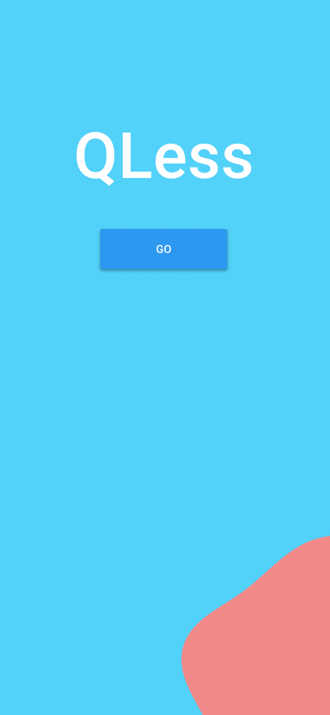

## Inspiration

Our team was inspired to build QLess in light of the devastating conditions imposed by the global COVID-19 pandemic. While nearly every aspect of our lives has been afflicted, there is one constant that plagues our health and our happiness: food. Access to a steady food source, whether it be from restaurants, supermarkets, or food banks, has been taken for granted in modern society. As the coronavirus extends its reach around the world, food providers have been faced with the challenge of balancing food inventory and recurring revenue with the social distancing of both customers and workers. As individuals with first-hand experience of these problems, we knew there had to be a better way of meeting our dietary and (anti-)social needs. Enter: QLess.

## What it does

QLess is a mobile application that provides members of a community with real-time analytics on wait times at local food markets. QLess scales to a diverse userbase by customizing its insights for individuals regardless of their social and economic backgrounds. This provides users with up-to-date info on the queue length of local food suppliers from high-end eateries to government-funded food stamps. The quantity and quality of partnerships with nearby food facilities will also be expanded upon through partnerships with relevant organizations (see "What's next for QLess" below). Our current offerings include locating local food suppliers and sorting search results by distance and queue waiting time.

## How we built it
On the front-end, we started by mapping out how are user interface would look using figma. Upon agreeing on the layout and aesthetics, we transitioned into creating the app using Flutter. We started off by reading the flutter documentation and watching tutorials and then built the app ourselves using the SDK. 

On the back-end, the QLess team created a relation database using Python, SQL, and Google Cloud to maintain real-time access to local food suppliers and the foot traffic they experience throughout the day. We also built multiple RESTful APIs using Java and Dart to enable efficient database access and storage. To meet user needs, we developed a suite of utility functions using Google Maps and its Geolocation API that will connect users with personalized results in seconds. These functionalities include: detecting geographic location of the mobile device, searching nearby stores using user input, computing relative distance between the user and food-bearing facilities, and providing local recommendations optimized for time and safety.

## Challenges we ran into
Throughout the course of our project, we brainstormed over 10 unique ideas and, after evaluating the potential of each pitch to tackling the COVID-19 pandemic, we collectively believed in QLess as a feasible and effective solution. This led to executing our idea through the design and development of a prototype Android application positioned for customer success.

Front-end: We scoured the web and ran dozens of trials across a diversity of platforms until ultimately deciding to use Flutter for our project demo. Flutter was the clear choice as it enabled us to develop QLess's user interface with agility and elegance without compromising the back-end functionality. As novice hackers using Flutter, we taught ourselves how to develop software applications using the Dart programming language. This furthered our knowledge of object-oriented design principles along with our knowledge of developing with the Android environment.

Back-end: To connect users with real-time insights, we required a scalable and efficient database system. After dissecting multiple database structures, we enter a grueling trial and error process until finally achieving success with a one-to-many object mapping relation (OMR) between food suppliers and store traffic throughout the day. Additionally, this was our first time using the Google Maps Platform and its Geolocation API, which required a deep understanding of the relationships between localization APIs and other toolkits and how they would impact the scalability of our code.

## Accomplishments
This was the first time any of us built an app from scratch, and it was a first hackathon experience for a few of us. Despite the initial frustrations, we were able to persevere through and complete an app that we are all very proud of. Some specific things we are happy about are learning how to use APIs, learning how to use Flutter, and integrating the front end and back end of the product well. 

## What we learned
By going through the product development process, we learned how to design, build, test, and deploy Android applications for social impact. Additionally, we gained unique experience working between front-end and back-end while continuously keeping in mind user needs. Lastly, we developed a breadth of technical skills across different programming languages (Python, Java, Dart, SQL) for a diversity of software platforms (Android, Flutter, Google Cloud, Google Maps).

## What's next for QLess
After our initial proof of concept, QLess aspires to revolutionize the food analytics industry through five major avenues.

First, QLess will make its services more accessible to communities around the world by partnering with more diverse businesses, governmental organizations, and nonprofits in the food sector. This will provide our users with a greater variety of choices for meeting nutritional needs, especially in highly populated regions with increased risk of contracting COVID-19.

Second, QLess seeks to create a food inventory management system to track food supply that is readily available on shelves and in back storage along with using predictive analytics to determine when the next shipment of products will be accessible to food suppliers.

Third, QLess aims to optimize the user experience by allowing consumers to filter food locations by operating hours, customer feedback, coupons, discounts, etc. This would expand our current setup which simply filters for queue time and relative distance.

Fourth, QLess plans to further personalize the user interface by employing artificial intelligence (AI) to better understand user preferences and dietary restrictions in conjunction with their present nutritional needs. This serves as a supplement to users by assisting them in determining which food products to purchase while minimizing time spent at the shop while obeying social distancing best practices. Additionally, we can use targeted machine learning by saving details from your positively-reviewed locations and making recommendations to potential top picks for your next shopping spree.

Lastly, QLess looks to improve customer engagement by making the service digitally accessible to those in highly populated regions globally. As such, we seek to expand our platform across Android, iOS, and web devices. We are currently prototyping our technology on the Google platform with the intent of product launch to Android users in the coming weeks. From here we can optimize our future endeavors in the iOS and web spaces for a comprehensive foodie experience.
